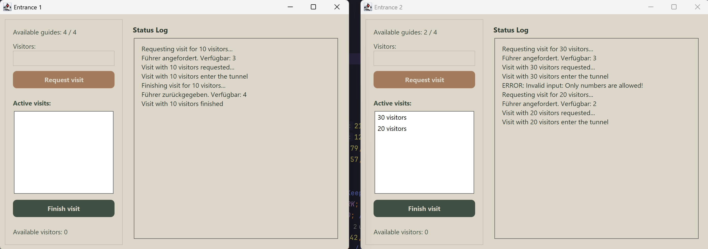

# Tunnel Visitor Simulation

<p align="center">
  
</p>

## Project Description

This project simulates visitor flow management for a capacity-limited resource, modeled after an archaeological tunnel scenario. It features a client-server architecture where multiple entrance clients interact with a central server to manage visitor entry and exit based on available guides and overall tunnel capacity.

### Scenario Context

The simulation is based on the following scenario:

*   An archaeologically significant tunnel is to be made accessible to the public.
*   The tunnel has two entrances, through which visitors can only tour the tunnel in groups accompanied by a guide.
*   There are four guides available *at each entrance* (managed locally by each client in this simulation).
*   For safety reasons, a maximum of 50 visitors may be in the tunnel simultaneously (managed globally by the server).
*   A guide accompanies a group from their entrance into the tunnel and returns with the group to the same entrance before starting another tour.

This Java application simulates this system, with graphical clients representing the entrances and a server managing the central tunnel capacity.

## Features

*   **Client-Server Architecture:** Uses Java Sockets (TCP/IP) for communication between entrances (clients) and the central monitor (server).
*   **Multiple Entrances:** Supports running multiple client instances simultaneously, each representing a separate tunnel entrance.
*   **Graphical User Interface:** Swing-based GUI for each client entrance, featuring:
    *   Modern look and feel (Nimbus with custom earthy/muted color palette).
    *   Rounded buttons and styled components.
    *   Display of available local guides.
    *   Input for requesting visits (number of visitors).
    *   List display of currently active visits originating from that entrance.
    *   Button to finish a selected active visit.
    *   Display of current overall visitor capacity available in the tunnel (polled from server).
    *   Real-time status log area.
*   **Guide Management:** Each client manages its own pool of local guides (`GuidesMonitor`).
*   **Capacity Management:** The server (`TunnelServer`, `VisitorsMonitor`) manages the overall tunnel capacity (max 50 visitors).
*   **Concurrency:** Handles concurrent requests from multiple clients using Java Threads.
*   **Periodic Checks:** Clients periodically query the server for the current available visitor capacity.

## Technology Stack

*   **Language:** Java (Requires JDK 8 or later recommended)
*   **Networking:** Java Sockets (`java.net.Socket`, `java.net.ServerSocket`)
*   **GUI:** Java Swing (using Nimbus Look & Feel)
*   **Concurrency:** Java Threads, `synchronized`, `wait`/`notifyAll`
## Setup and Running

1.  **Prerequisites:**
    *   Java Development Kit (JDK) version 8 or higher installed and configured. You can check with `java -version` and `javac -version` in your terminal.
    *   A Java IDE (like IntelliJ IDEA, Eclipse, VS Code with Java extensions) is recommended for the easiest setup.

2.  **Running the Application (IDE - Recommended):**
    *   Import the project into your IDE.
    *   **Start the Server:**
        *   Locate the `tunnel.server.ServerMain` class (or your specific server main class).
        *   Run this class (e.g., right-click -> Run 'ServerMain.main()' or use the IDE's run button).
        *   The server's console output will appear in the IDE's console/run window. It needs to be running before clients connect.
    *   **Start the Clients:**
        *   Locate the `tunnel.client.ClientForm` class.
        *   Run this class using the same method as the server **only once**.
        *   **Important:** This single execution of `ClientForm.main()` is designed to launch **both** client GUIs ("Entrance 1" and "Entrance 2"), positioning them side-by-side.
    *   You should now have the server running (output visible in the IDE) and the two client windows ready for interaction.

3.  **Running the Application (Terminal - Alternative):**
    *   **Compile (if necessary):** Open a terminal/command prompt in the project's root directory (containing the `tunnel` folder). If you haven't compiled using an IDE, run:
        ```bash
        # On Windows: javac tunnel\server\*.java tunnel\client\*.java
        # On Linux/macOS: javac tunnel/server/*.java tunnel/client/*.java
        ```
    *   **Run:**
        *   **Start Server:** In the terminal, run:
            ```bash
            java tunnel.server.ServerMain
            ```
            *(Replace `ServerMain` if your server class has a different name)*
        *   **Start Clients:** Open **one separate** terminal window and run:
            ```bash
            java tunnel.client.ClientForm
            ```
            *(This single command will launch both client GUIs side-by-side)*
## Potential Future Improvements

*   Implement simulated visit durations.
*   Move guide management fully to the server for a global pool.
*   Add a server-side admin interface.
*   Implement more detailed server responses and client feedback.
*   Add configuration files for server host/port, capacities, etc.

---

## License

This project is licensed under the terms specified in the [LICENSE](LICENSE) file.
